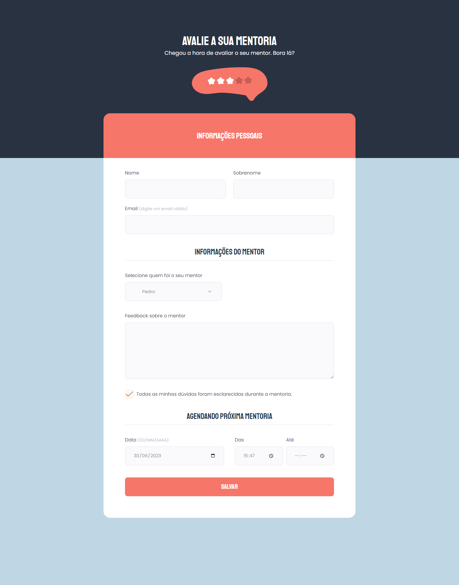

  

## 🖥️ Projeto
Nesse projeto pude desenvolvider uma página de formulário para avaliar uma mentoria, que foi o formulário do desafio anterior, trabalhei muitos conceitos de formulário e os seus campos, além de estilizar de acordo com o layout do figma, ficou muito bonito o resultado final.

## 🚀 Tecnologias
Foi desenvolvido esse projeto no programa Explorer da Rocketseat no stage 02.

- HTML
- CSS
- GIT
- GITHUB
- FIGMA

## 👁 View
Aqui você pode visualizar o layout do projeto
<a 
  href="https://www.figma.com/file/a1qWlpiuqiWPN2j2zv15tf/Stage-03---Formul%C3%A1rio-avan%C3%A7ado-(Copy)?type=design&node-id=0-1&t=E7xRhORbOQaLA1mR-0" target="_blank">clique aqui</a>
